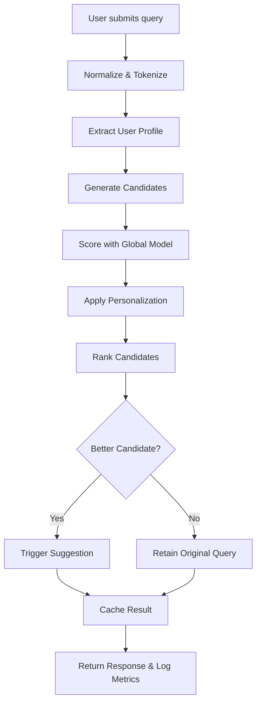

# Modular Production Plan for Implementing Google's "Did You Mean" Feature

## 1. Overview
This document details a modular, production-ready plan for implementing a "Did you mean" feature similar to Google Search.
The design leverages global language models, personalized signals, and efficient candidate generation to provide real-time corrections.

## 2. Architecture and Modular Components
- **Data Ingestion & Preprocessing Module**: Normalizes and tokenizes user queries.
- **Candidate Generation Module**: Uses indexed lookup, edit distance, and phonetic matching.
- **Ranking Module**: Ranks candidates using n-gram probabilities and personalization weights.
- **Correction Decision Module**: Evaluates top candidates and determines if a suggestion should be triggered.
- **Microservices Integration Module**: Exposes functionalities via REST API through an API Gateway.
- **Caching & Scalability Module**: Uses caching (e.g., Redis) and load balancing for high availability.
- **Monitoring & Logging Module**: Captures system performance metrics and user interactions.

## 3. Detailed Module Description

### 3.1 Data Ingestion & Preprocessing
- **Input Processing**: Lowercase conversion, diacritic removal, and punctuation normalization.
- **Tokenization**: Splitting query into tokens for individual analysis.
- **User Profile Extraction**: Fetches historical data to enable personalization.

### 3.2 Candidate Generation
- **Lookup Mechanism**: Retrieve candidate words based on an indexed dictionary of query logs.
- **Edit Distance Filtering**: Use Levenshtein distance to select plausible candidates.
- **Phonetic Matching**: Incorporate sound-based algorithms for homophone corrections.

### 3.3 Candidate Ranking
- **Global Language Model Scoring**: Utilize n-gram models trained on large query datasets.
- **Personalization Weighting**: Blend in user-specific signals to adjust rankings.
- **Thresholding**: Set performance thresholds to determine when to suggest a correction.

### 3.4 Correction Decision Logic
- **Real-Time Processing**: Evaluate candidate scores asynchronously as users type.
- **Suggestion Trigger**: Display “Did you mean” prompt if a significantly better candidate is determined.
- **Result Caching**: Cache frequent corrections to minimize latency.

### 3.5 Microservices and Integration
- **API Gateway**: Entry point for client search queries, handling authentication and rate limiting.
- **Service Orchestration**: Use load balancers and auto-scaling to distribute traffic.
- **Service Communication**: Utilize REST or gRPC for low-latency communication among services.

## 4. Flowchart Diagram


## 5. Implementation Milestones
1. Develop and test the data ingestion and preprocessing module.
2. Implement candidate generation logic with indexed lookup and edit distance.
3. Integrate and test candidate ranking using language and personalization models.
4. Build API Gateway and microservice infrastructure.
5. Deploy caching and load balancing mechanisms.
6. Set up monitoring, logging, and A/B testing for continuous improvement.

## 6. Future Enhancements
- Dynamic model retraining based on new query data.
- Enhanced personalization leveraging real-time user behavior.
- Continuous performance optimization using automated testing.

## 7. Conclusion
This modular plan outlines a detailed, implementable strategy for a production-scale "Did you mean" feature. It emphasizes scalability, fault tolerance, and real-time processing, ensuring an exceptional user search experience.
## Seed Data

Below is the JSON seed data for keywords required for initial implementation:

```json
{
  "keywords": [
    "weather",
    "news",
    "sports",
    "movies",
    "books",
    "music",
    "technology",
    "health",
    "finance",
    "travel"
  ]
}
```